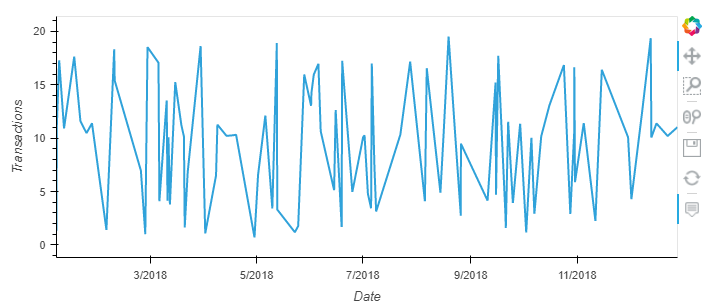
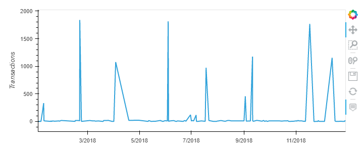
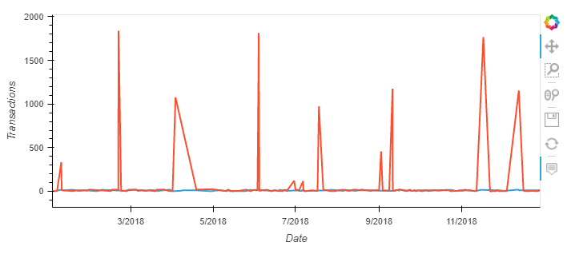
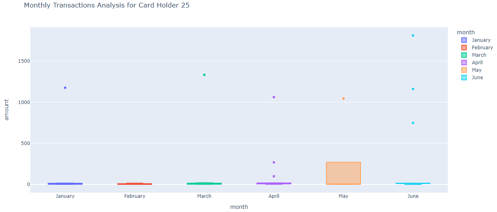

# Unit 7 Homework Assignment: Looking for Suspicious Transactions CFO Report

*[Credit Card Fraudster by Richard Patterson](https://www.flickr.com/photos/136770128@N07/42252105582/) | [Creative Commons Licensed](https://creativecommons.org/licenses/by/2.0/)*

## Background

This report has been generated for the CFO of the firm. This report has been requested to help analyze potential fraudulent transactions. This report will show the queries generated on the fraud_detection database that will discover the information requested by the CFO.

---

#### Part 1:

* Some fraudsters hack a credit card by making several small transactions (generally less than $2.00), which are typically ignored by cardholders. 

  * How can you isolate (or group) the transactions of each cardholder?

    - **PART 1 Question 1 ANSWER:** See query for ***Data Analysis Part 1 Question 1*** in query.sql

  * Count the transactions that are less than $2.00 per cardholder. 
   
    - **PART 1 Question 2 ANSWER:**  See query for ***Data Analysis Part 1 Question 2*** in query.sql
  
  * Is there any evidence to suggest that a credit card has been hacked? Explain your rationale.

    - **PART 1 Question 3 ANSWER:**  There is evidence of several small transactions (less than $2) on 53 credit cards. There are 6 credit cards which have 10 or more transactions less than $2 recorded. This would indicate, ***YES*** there is evidence that indicates credit cards may have been hacked. 

* Take your investigation a step futher by considering the time period in which potentially fraudulent transactions are made. 

  * What are the top 100 highest transactions made between 7:00 am and 9:00 am?

    - **PART 1 Question 4 ANSWER:**  See query for ***Data Analysis Part 1 Question 4*** in query.sql

  * Do you see any anomalous transactions that could be fraudulent?

    - **PART 1 Question 5 ANSWER:**  See query for ***Data Analysis Part 1 Question 5*** 91 of the top 100 highest transaction are under $100 and there is quite a low spread across these transactions. There is however 9 transactions that you would conisder outliers in this data. The amounts jump significantly from 100 to 748, then several around 1000, then up again to a maximum of 1894.

  * Is there a higher number of fraudulent transactions made during this time frame versus the rest of the day?

    - **PART 1 Question 6 ANSWER:**  There are 30 potentially fraudlent transactions between 7am and 9am across all the data. See query for ***Data Analysis Part 1 Question 6a***.  There are 320 potentially fruadulent transactions between 9am and 7am See query for ***Data Analysis Part 1 Question 6b*** . If we average this out it can be concluded that there are 15 potential fraudulent transactions per hour block in the data between 7-9 am. If we average this out it can be concluded that there are 14.54 potential fraudulent transactions per hour block in the data between 9-7 am. While very close there are slightly more potentially fraudulent data occuring between 7-9am.
    

  * If you answered yes to the previous question, explain why you think there might be fraudulent transactions during this time frame.

    - **PART 1 Question 7 ANSWER:**  I believe hackers have deliberatley targetted this time of day to make fraudulent transactions as people are less likely to notice. This is generally the start of the day where people are busy potenitally getting ready to go to work etc, and are often speding money on food or travel. These transactions are also in normal hours people are awake and as such may not be as noticable as a transaction in the middle of the night when people are asleep and would think it was unusual to see a tranasaction at that time.  

* What are the top 5 merchants prone to being hacked using small transactions?
  
  - **PART 1 Question 8 ANSWER:**  See query for ***Data Analysis Part 1 Question 8*** in query.sql. The top 5 Merchants that are prone to being hacked using small transactions are : Wood-Ramirez, Hood-Phillips, Baker Inc, Mcdaniel, Hines and Mcfarland, Hamilton-Mcfarland
  
  
* Create a view for each of your queries.

  - **PART 1 Question 9 ANSWER:**  See section ***Create VIEWS for all queries*** in query.sql

#### Part 2:

Your CFO has also requested detailed trends data on specific card holders. Use the [starter notebook](Starter_Files/challenge.ipynb) to query your database and generate visualizations that supply the requested information as follows, then add your visualizations and observations to your markdown report:      

* The two most important customers of the firm may have been hacked. Verify if there are any fraudulent transactions in their history. For privacy reasons, you only know that their cardholder IDs are 2 and 18.

  * Using hvPlot, create a line plot representing the time series of transactions over the course of the year for each cardholder separately. 
  - **PART 2 Question 1 ANSWER:**

  

  
  
  * Next, to better compare their patterns, create a single line plot that contains both card holders' trend data.  
  - **PART 2 Question 2 ANSWER:**

  

  * What difference do you observe between the consumption patterns? Does the difference suggest a fraudulent transaction? Explain your rationale.
   - **PART 2 Question 3 ANSWER:** Looking at the visualisation for each card holders transactions there is a significant difference. The most notable is for cardholder 18, there appears to be lots of small transactions then at approximatley 4 week intervals there is a large transaction. This looks like fraud where a hacker is potentially doing lots of small transactions, then if this is not noticed and credit card has not been cancelled then they attempt a large transaction. This behaviour appears to continue and is repeated regularly over the period of this data set. 

* The CEO of the biggest customer of the firm suspects that someone has used her corporate credit card without authorization in the first quarter of 2018 to pay quite expensive restaurant bills. Again, for privacy reasons, you know only that the cardholder ID in question is 25.

  * Using Plotly Express, create a box plot, representing the expenditure data from January 2018 to June 2018 for cardholder ID 25.
  
  - **PART 2 Question 4 ANSWER:** 

  

  * Are there any outliers for cardholder ID 25? How many outliers are there per month?
  - **PART 2 Question 5 ANSWER:** Looking at the transaction plots for card holder 25 between January and June it can be seen that there are several outliers. January - 1, February - 0, March 1, April - 3, May - 1, June - 3.

  * Do you notice any anomalies? Describe your observations and conclusions.
  - **PART 2 Question 6 ANSWER:** In addition to the outliers, there is also an anolmoly in May. It can be observered that there is a significant differece in the box plot spread for May. For some reason this month had a much larger spread of typical amounts spent on this card holders card. 
  

### Challenge

Another approach to identifying fraudulent transactions is to look for outliers in the data. Standard deviation or quartiles are often used to detect outliers.

Use the [challenge starter notebook](Starter_Files/challenge.ipynb) to code two Python functions:

* One that uses standard deviation to identify anomalies for any cardholder.

* Another that uses interquartile range to identify anomalies for any cardholder.

